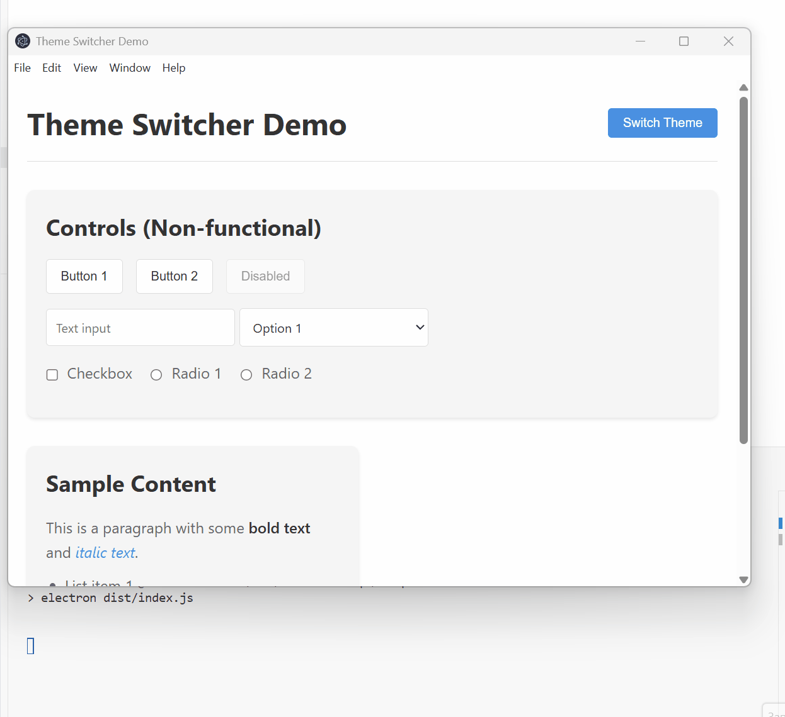

# electron-wcap example

Demo app that demonstrated typical case of web application designed to be embedded to mobile webview or electron and exposes some api.

## Scripts

- `pnpm build` — Build application.
	Output: `dist/`.
- `pnpm start` — Starts the app.
